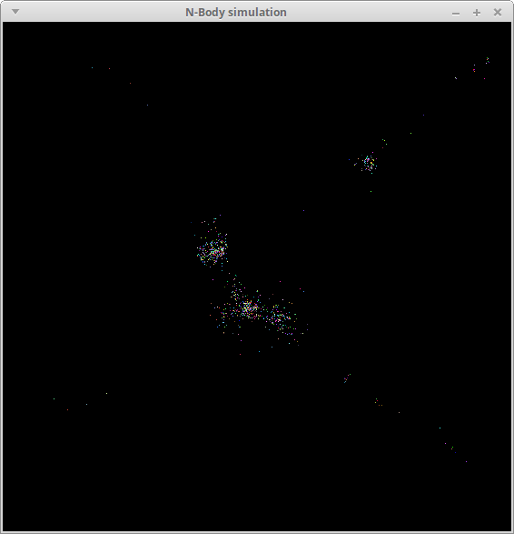

*Preliminary assignment description, not finalized yet*

# Getting Started

Download [CS365\_Assign03.zip](CS365_Assign03.zip). Unzip it on the cluster head node (or your local machine, if you are running Linux).

To compile the sequential and parallel versions of the programs, run the command

    make

To run the programs:

    ./nbody_seq

    ./nbody_par

*TODO* &mdash; describe the `-t` and `-p` parameters to the parallel version of the program.

If you want to compile the program using Linux on your own computer, you will to build [libui](https://github.com/andlabs/libui).  If you are using Ubuntu, the following commands should work:

    sudo apt-get install libgtk-3-dev cmake
    cd /usr/local
    sudo mkdir libui
    sudo chown $USER:$USER libui
    git clone https://github.com/andlabs/libui.git
    cd libui
    mkdir build
    cd build
    cmake ..
    make

If you are using a distribution other than Ubuntu, I can help you build `libui`.

# Your task

The `nbody_seq` program is a sequential [N-Body simulation](https://en.wikipedia.org/wiki/N-body_simulation).  When you run the program, you will see something like the following:

> 

The program works by calling the `sim_tick` function repeatedly and drawing the positions of the simulated bodies as colored pixels in a GUI window.  You can see the code for the sequential version of the simulation in the `sim_seq.c` source file.

Your task is to parallelize the first loop in the `sim_tick` function, which accounts for the majority of the running time of the simulation.  The basic idea is fairly simple: create multiple worker threads in the `sim_create` function, and have each thread handle part of the range of indices of the computaton's (outer) loop when instructed to do so by `sim_tick`.  Note that the `sim_create` function should create as many threads as specified by the `num_threads` field in the `SimulationParams` object passed as a parameter: this will allow you to experiment with running the program using varying numbers of threads.

## Suggested approach

The main challenge in this program is to have the worker threads do the specified parts of the computation when necessary.  A good strategy is to use the `MTQueue` data structure you implemented in [Lab 8](../labs/lab08.html).  In the `Simulation` data type, allocate two instances of `MTQueue`.  One will be used by `sim_tick` to send work to the worker threads.  The other will be used by the worker threads to let `sim_tick` know that work has been completed.

When `sim_tick` is called, create "message" objects indicating ranges of indices to compute.  Add these message objects to the first queue.  The worker threads should execute a loop waiting for messages from `sim_tick`, and then perform the computation for the specified range of indices.  When a worker completes its work, it should create a "finished" message and add it to the second queue.  The `sim_tick` function will know that the entire computation (for one time step) has been completed when it has received "finished" messages for each range of indices.

If you do decide to use `MTQueue` in your parallel computation, you should

* copy `mtqueue.c` and `mtqueue.h` from the `CS365_Lab08` directory into the `CS365_Assign03` directory
* add the source file `mtqueue.c` to the `SRCS_COMMON` macro in `Makefile`
* add `#include "mtqueue.h"` to the source file `sim_par.c`

## Hints

Coming soon.

# Deliverables

Coming soon.

# Grading

Coming soon.

# Submitting

Run the command

    make submit

Type your Marmoset username and password when prompted.
