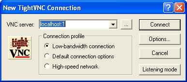

This page describes how to use ssh to create a tunnel to allow you to connect a VNC client to a VNC server on the cluster head node from off campus.  (You won't need to do this when you are connected to the campus network.)

Requirements:

-   You need an ssh client: the one from [cygwin](http://cygwin.com) works well.
-   You need a VNC client (see the [resources](resources.html) page.) [TightVNC](http://www.tightvnc.com/) works very well.

Procedure
=========

Add 5900 to your VNC session number to compute the port number. I.e., if your session number is 12, then your port number is 5912.

In a cygwin shell, run the command

> <code>ssh -L<i>port</i>:cscluster.ycp.edu:<i>port</i> <i>username</i>@cs.ycp.edu</code>

*port* is your port number, *username* is your YCP username.

Log in with your YCP username and password.

Now, start the VNC client on your local machine. You will probably want to use the "Low-bandwith connection" option. Enter

> localhost:*session*

as the VNC server, where *session* is your session number. Before you start the session, the start dialog should look something like this:

> 

You will most likely use a different session number than the one shown above. Click **Connect**, enter the password you are using to protect your VNC session, and you should see your Linux desktop.

Finding your session number
===========================

If you can't remember your session number, do the following:

    ssh username@cscluster
    ps auxwww|grep Xtightvnc|grep username

Replace `username` with your username.  You should see output similar to the following:

    dhovemey 29433  0.1  0.0  47040 23308 ?        S    Jan22  46:48 Xtightvnc :2 -desktop X -auth /space/home/dhovemey/.Xauthority -geometry 1024x768 -depth 24 -rfbwait 120000 -rfbauth /space/home/dhovemey/.vnc/passwd -rfbport 5902 -fp /usr/share/fonts/X11/misc/,/usr/share/fonts/X11/Type1/,/usr/share/fonts/X11/75dpi/,/usr/share/fonts/X11/100dpi/ -co /etc/X11/rgb

The `:2` in the output indicates that my session number is 2.
